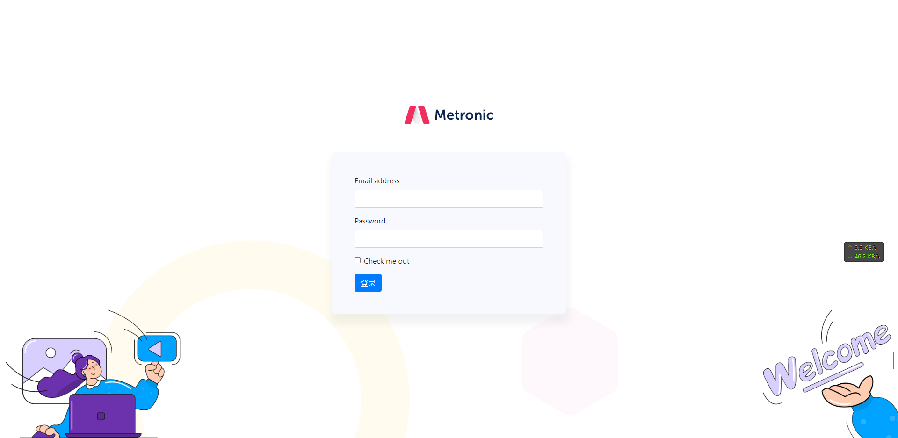
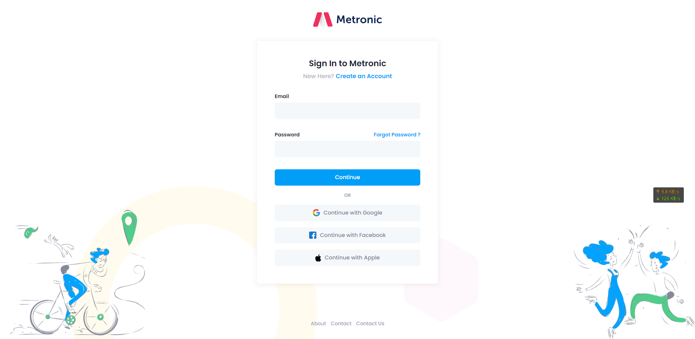
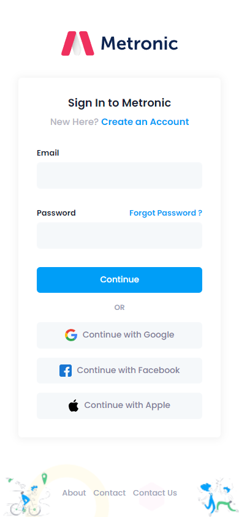

# momo-learn

其中笔记位于`flexBox`文件夹下。

---

自己写的demo位于`demo`下，其中存在一个问题。
问题描述：

页面在1920*1080下是正常的，但是切换到手机设备进行仿真的时候，会出现如下情况。

---
页面是仿照`metronic`的登录界面编写的，正常情况下应该是这样的。可以发现很明显的from表单部分大小出了问题，但是目前还没发现去如何修改适配。

